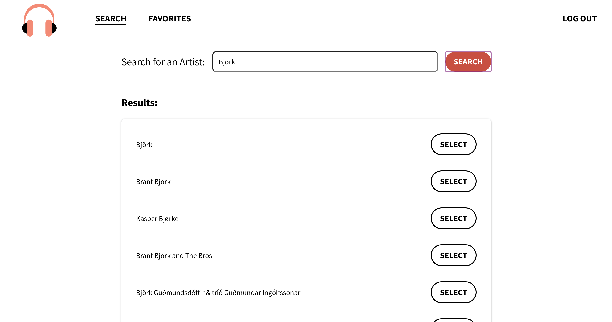

# 🎧 last.fm Artist Search

A responsive web app that lets you search for an artist, see a short biography and list of top albums, and gives you the option to save the artist to a list of your favorite artists. This app uses the [last.fm API](https://www.last.fm/api).

Note, there are no database connections. Any artists you save to your list of favorites will only persist over the course of your session. 😊

This app also uses an authentication flow, so you will need a [last.fm](https://www.last.fm/) account in order to proceed. Authentication is not actually needed to use the last.fm API, however, it was a requirement for this project.

⚡️ **[View Live Demo](https://last-fm-artist-search.netlify.app/)** ⚡️

## 📸 Screenshots

|  |
| :-------------------------------------------: |
|                 _Login View_                  |

|  |
| :--------------------------------------------: |
|                 _Search View_                  |

|  |
| :------------------------------------------------------: |
|                    _Artist Info View_                    |

|  |
| :---------------------------------------------------------: |
|                   _Favorite Artists View_                   |

## 📄 Docs

-   [Getting Started](./docs/setup/SETUP.md)
-   [Design](./docs/design/DESIGN.md)
-   [Security](./docs/security/SECURITY.md)
-   [Testing](./docs/testing/TESTING.md)

## ⚡️ Technologies

-   React
-   TypeScript
-   Styled Components
-   React Context API
-   React Router
-   React Spring
-   React Testing Library
-   Jest

## ✅ Requirements

-   Obtain an authentication token through [last.fm](https://www.last.fm/)
-   Build a search input that enables a user to search for their favorite artist
-   After searching for an artist a list of relevant artists should populate the page
-   A user should be able to select an artist from the search page that will show biographical information (feel free to include discography)
-   Upload your project into Github

## ✏️ User stories

-   A user can log in using last.fm
-   A user can search for an artist and see search results
-   A user can select an artist and see their biography and top albums
-   A user can add an artist to their list of favorites
-   A user can remove an artist from their list of favorites
-   A user can log out of their account

## 📋 To dos

-   [x] Init project
-   [x] Add ESLint and Prettier configs
-   [x] Add styled-components and set up themes
-   [x] Add routing
-   [x] Create login page
-   [x] Login authentication
-   [x] Logout
-   [x] Navigation and routing
-   [x] Mobile navigation
-   [x] Loading indicator
-   [x] Profile page
-   [x] Projects page
-   [x] Favorites page
-   [x] Tests
-   [ ] More tests!
-   [ ] Storybook intergration
