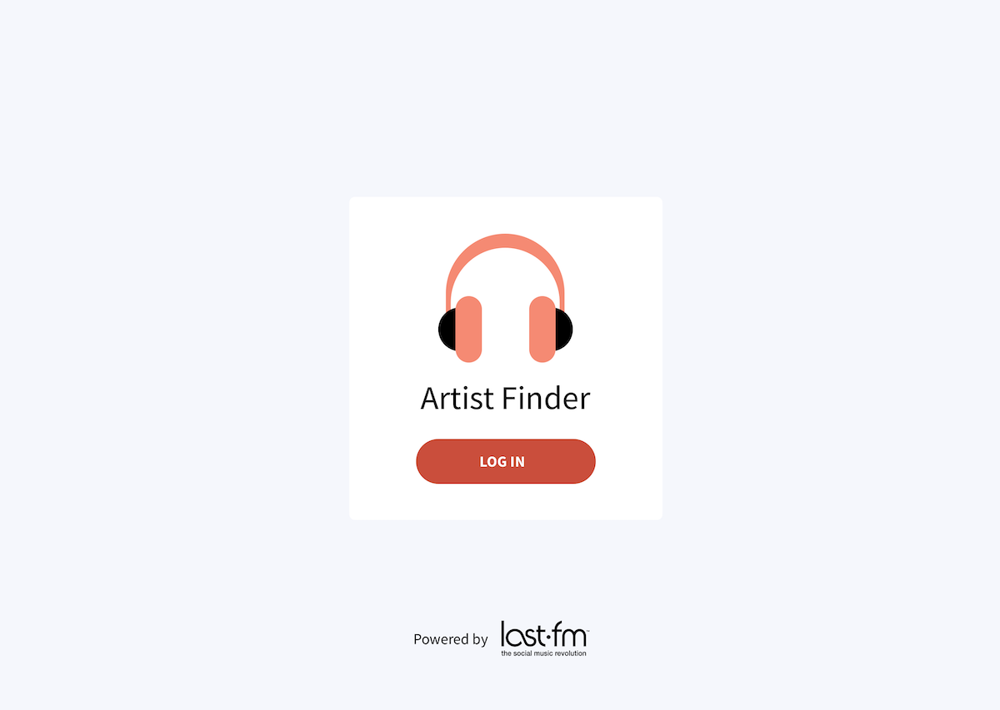

# Design

The project spec required that I display the following:

-   Some way to log in via last.fm
-   A search input
-   Search results of artist names
-   A selected artist's biography

Before I started building the application, I used [Postman](https://www.postman.com/) to see what sort of information I could retrieve from the last.fm API. I also decided to incorporate the following:

-   Names of the selected artist's top albums
-   Images of the selected artist's top albums
-   A way to add an artist to a list of favorite artists
-   A way to view favorite artists

Next, I created some basic wireframes using [Excalidraw](https://excalidraw.com/). The wireframes show the login, search, artist, and favorite artist pages with mobile and desktop views.

Then, I went ahead and created some UI mockups using [Sketch](https://www.sketch.com/). I went with a simple, clean design that was mostly responsive out-of-the-box, which would be quick to build.

|  |  |
| :-------------------------------------------: | :---------------------------------------------: |
|            _Login View (Desktop)_             |             _Search View (Desktop)_             |

|  |  |
| :--------------------------------------------------: | :----------------------------------------------------------: |
|             _Artist Info View (Desktop)_             |              _Favorite Artists View (Desktop)_               |

|  |  |  |  |
| :-----------------------------------------: | :-------------------------------------------: | :------------------------------------------------: | :----------------------------------------------------------: |
|            _Login View (Mobile)_            |            _Search View (Mobile)_             |            _Artist Info View (Mobile)_             |               _Favorite Artists View (Mobile)_               |
